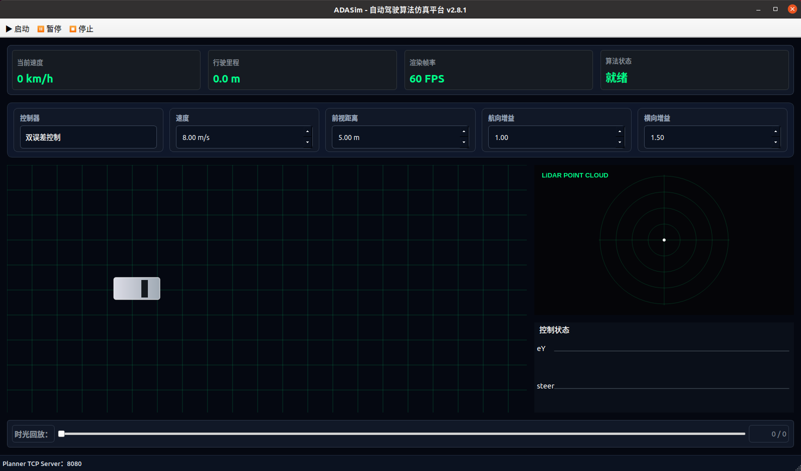
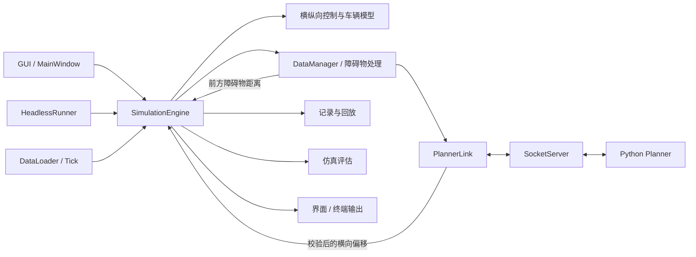

# ADASim

基于 **C++17 / Qt / Linux** 的二维驾驶算法仿真与场景回归测试项目。

项目围绕车辆控制、障碍物处理、跨进程通信和自动化测试展开，支持图形界面与无界面运行，适用于基础算法学习和软件工程实践。

## 核心功能



- **统一仿真引擎**：GUI 与 headless 复用 SimulationEngine 中的车辆状态更新、控制、记录与评估逻辑。
- **车辆控制**：提供 DualError 和 Pure Pursuit 两种横向控制，以及纵向速度控制、TTC 计算和简化紧急制动。
- **规划器通信**：通过 TCP/JSON 对接 Python Planner，使用协议版本、会话标识、帧编号和有效期校验回复。
- **场景与测试**：支持 JSON 场景、批量回归运行、退出码和报告输出，配置 Qt Test、CTest 与 GitHub Actions。
- **运行记录**：提供仿真帧记录与回放相关功能。

## 技术栈

| 类别 | 技术 |
|---|---|
| 语言 | C++17、Python 3 |
| 界面 | Qt Widgets |
| 线程与事件 | QThread、Signal/Slot、QTimer |
| 网络 | QTcpServer、QTcpSocket、TCP、JSON 行协议 |
| 构建 | CMake |
| 测试 | Qt Test、CTest、Bash |
| 持续集成 | GitHub Actions |
| Linux 集成 | syslog、sigaction、SIGINT / SIGTERM |

## 快速开始

以下命令在仓库根目录执行。

当前 CI 配置使用 **Ubuntu 22.04 + Qt 5**。CMake 支持查找 Qt 5 或 Qt 6，但不代表所有版本组合均已验证。

### 1. 安装依赖

```bash
sudo apt update
sudo apt install -y \
  build-essential \
  cmake \
  qtbase5-dev \
  qtbase5-dev-tools \
  python3
```

### 2. 构建

```bash
cmake -S . -B build-debug \
  -DCMAKE_BUILD_TYPE=Debug \
  -DBUILD_TESTING=ON

cmake --build build-debug --parallel
```

### 3. 启动图形界面

在有图形桌面的环境中执行：

```bash
./build-debug/ADASim --config config/adasim.ini
```

打开窗口后，通过界面操作运行仿真。

### 4. 执行无界面场景测试

```bash
./build-debug/ADASim \
  --headless \
  --test \
  --config config/adasim.ini \
  --scenario scenarios/empty.json
```

程序按场景指定帧数运行，结束后生成：

```text
test_result/report.txt
```

测试退出码：

| 退出码 | 含义 |
|---|---|
| `0` | 评估通过且报告保存成功 |
| `1` | 运行完成，但评估未通过 |
| `2` | 运行错误、报告保存失败或测试被中断 |

### 5. 执行自动化测试

```bash
ctest --test-dir build-debug --output-on-failure
```

### 6. 执行场景回归套件

```bash
./build-debug/ADASim \
  --headless \
  --config config/adasim.ini \
  --suite scenarios/regression.json
```

汇总报告生成于：

```text
test_result/summary.txt
```

执行测试与回归套件时，不要连接外部 Python Planner，以免改变场景原本要验证的行为。

更多参数、配置和输出说明见 [使用说明](docs/usage.md)。

## 系统架构



- **SimulationEngine**：集中处理仿真步进与车辆控制，供两种入口复用。
- **DataManager**：处理车辆状态、点云与障碍物信息。
- **SocketServer**：处理 TCP 连接、消息分帧和传输限制。
- **PlannerLink**：处理协议字段、会话、帧顺序和时效校验。
- **TestEvaluator / TestSuiteRunner**：完成运行时评估与批量场景汇总。

图中表示模块连接关系，完整 Python 规划避障效果仍需端到端验证。

详细线程分工与数据流见 [系统架构](docs/architecture.md)。

## 工程设计

### 仿真逻辑与界面分离

GUI 与 headless 使用同一个仿真引擎，使场景运行和测试无需依赖窗口交互。

当前两种模式的线程布局不同：GUI 将 DataLoader 和 DataManager 放入后台线程，headless 使用主事件循环。复用仿真引擎不代表两种模式的执行时序完全一致。

### 规划器回复校验

为避免旧回复或乱序回复进入当前控制流程，通信层使用：

- `protocol_version`：识别协议格式。
- `session_id`：区分连接和仿真运行周期。
- `frame_id`：关联请求与回复，拒绝重复、乱序和未知编号。
- 本地单调时钟：校验数据年龄，当前有效期为 500 ms。

TCP 层另有限制消息长度、发送积压和单轮消息处理数量的逻辑。

消息格式和校验规则见 [通信协议](docs/protocol.md)。

### 场景驱动评估

场景 JSON 可定义障碍物、运行帧数和 AEB 期望：

```json
{
  "name": "straight_obstacle",
  "obstacles": [
    {
      "x": 20.0,
      "y": 0.0
    }
  ],
  "test": {
    "max_frames": 200,
    "aeb_expectation": "Required"
  }
}
```

AEB 期望支持：

- `Any`：不限制是否触发。
- `Required`：必须触发。
- `Forbidden`：不允许触发。

当前评估结合帧数、简化碰撞判据与 AEB 期望给出结果。

## 测试范围

当前 CTest 注册以下条目：

| 测试 | 主要验证内容 |
|---|---|
| `test_test_evaluator` | 评估器的通过与失败条件 |
| `test_scenario_loader` | 场景解析、默认配置和非法输入 |
| `test_socket_server` | TCP 分帧、长度边界与连接管理 |
| `test_planner_link` | 回复字段、顺序、会话和时效 |
| `headless_empty_scenario` | 无界面运行、退出码与报告生成 |

GitHub Actions 在 push 和 pull request 时执行构建与 CTest。

当前 CI 未单独执行完整场景套件，也未执行 Python Planner 端到端验证。测试范围、结果解释和验证证据要求见 [测试说明](docs/testing.md)。

## 仓库结构

```text
ADASim/
├── .github/workflows/       # 持续集成
├── cmake/                  # 构建辅助文件
├── config/                 # INI 配置
├── docs/                   # 使用、架构、协议与测试文档
├── scenarios/              # JSON 场景与回归套件
├── src/
│   ├── algorithm/          # 车辆模型与控制算法
│   ├── backend/            # 仿真引擎、数据处理、记录
│   ├── communication/      # TCP 与 Planner 协议
│   ├── config/             # 配置读写
│   ├── gui/                # 图形界面
│   ├── headless/           # 无界面入口
│   ├── scenario/           # 场景解析
│   ├── system/             # Linux 日志与信号处理
│   ├── test/               # 运行时评估与套件执行
│   └── main.cpp
├── tests/                  # 自动化测试与测试数据
├── tools/                  # Python Planner
├── CMakeLists.txt
├── LICENSE
└── README.md
```

`src/test/` 是程序的运行时评估模块，`tests/` 是验证代码的自动化测试。

`build-*/`、`record/` 和 `test_result/` 属于本地构建或运行输出，不作为普通源码维护。

## 当前状态与限制

- 使用简化二维场景、车辆模型和障碍物表示，不是完整自动驾驶系统。
- 当前碰撞评分基于前方距离阈值，不是完整车身几何碰撞检测。
- JSON 场景目前通过 headless 入口加载，GUI 尚未接入同样的命令行场景加载流程。
- Python Planner 采用有限候选横向偏移的代价评估，不是通用轨迹规划器。
- 当前 Python 脚本存在语法、控制流程和序列化调用问题，修复前不能直接运行。
- 当前 C++ 接收横向偏移的入口尚未接入完整轨迹更新流程，需要修复并进行端到端验证。
- 现有自动化测试通过不能证明完整规划避障功能或所有场景均已验证。

具体问题与验证方法见 [使用说明](docs/usage.md) 和 [测试说明](docs/testing.md)。

## 文档

- [使用说明](docs/usage.md)：环境、构建、启动、配置与常见问题。
- [系统架构](docs/architecture.md)：模块职责、线程分工与数据流。
- [通信协议](docs/protocol.md)：消息格式、会话、顺序与时效规则。
- [测试说明](docs/testing.md)：测试入口、评估条件、报告与验证边界。

## 许可证

本项目采用 [MIT License](LICENSE)。