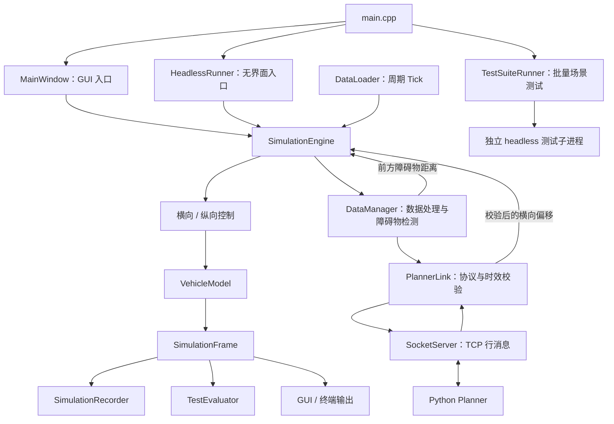

# 系统架构

ADASim 是基于 C++17、Qt 和 Python 的二维驾驶算法仿真项目，用于学习车辆控制、跨进程通信和场景回归测试。

系统支持 GUI 与 headless 两种运行方式，两者复用 SimulationEngine 中的仿真逻辑。

## 1. 设计目标

- 将仿真逻辑与界面展示分离，支持无窗口运行。
- 使用模块化结构组织车辆模型、控制算法、数据处理和通信。
- 通过 TCP/JSON 对接独立 Python 规划器。
- 使用场景文件和自动化测试验证部分功能与异常处理行为。

本项目采用简化车辆模型、障碍物表示与碰撞判据，适用于学习和软件功能验证。

## 2. 模块关系

图中通信链路表示代码中的模块连接关系；完整规划避障效果仍需端到端验证。

## 3. 目录职责

| 目录 | 职责 |
|---|---|
| `src/algorithm/` | 车辆模型、障碍物检测、路径预测、横向与纵向控制 |
| `src/backend/` | Tick、数据处理、仿真引擎、帧记录 |
| `src/communication/` | TCP 传输、消息校验、规划器时钟 |
| `src/gui/` | 主窗口、二维场景、传感器和控制信息展示 |
| `src/headless/` | 无界面启动、场景加载、运行与收尾 |
| `src/scenario/` | JSON 场景解析与校验 |
| `src/test/` | 运行时评估、测试套件与汇总报告 |
| `src/config/` | INI 配置读写 |
| `src/system/` | Linux 日志与终止信号处理 |
| `tests/` | Qt Test 测试、测试数据和 smoke 脚本 |
| `tools/` | Python Planner |
| `scenarios/` | 示例场景与回归套件 |

`src/test/` 是程序自身的评估功能；`tests/` 是用于验证代码的自动化测试。

## 4. 两种运行方式

### GUI

入口创建 QApplication 和 MainWindow。

MainWindow 负责界面、模块装配与交互；SimulationEngine 负责仿真状态更新。

当前线程分工：

- 主线程：GUI、SimulationEngine、SocketServer、PlannerLink。
- 后台 QThread：DataLoader、DataManager。
- 跨线程数据通过 Qt Signal/Slot 传递，后台对象的操作需遵守其线程归属。

仿真核心从界面类中拆出，不等于仿真核心已经运行在独立工作线程。

### Headless

入口创建 QCoreApplication 和 HeadlessRunner，不创建主窗口。

HeadlessRunner 负责：

1. 加载 INI 配置。
2. 创建仿真、数据处理和通信模块。
3. 加载指定 JSON 场景。
4. 启动记录与周期 Tick。
5. 在测试模式结束时写报告并返回退出码。

当前 headless 实现未建立 GUI 模式中的后台 QThread，相关对象在主事件循环中工作。

两种模式复用仿真逻辑，但线程布局不同。

## 5. 仿真数据流

DataLoader 使用 QTimer，以 100 ms 的间隔发出 Tick。

SimulationEngine 在 Tick 到达后：

1. 读取当前车辆状态与参考轨迹。
2. 根据目标速度和前方障碍物距离计算纵向控制。
3. 根据所选横向控制器计算转向。
4. 推进车辆模型。
5. 将车辆状态交给 DataManager 进行数据处理。
6. 生成 SimulationFrame，供记录、评估和展示使用。

GUI 模式的数据处理跨越线程，反馈可能异步到达。当前结构不应被理解为具有严格实时保证的调度系统。

## 6. 控制与规划

### 横向控制

支持两种模式：

- DualError：根据横向误差和航向误差计算控制输出。
- PurePursuit：根据前视目标点计算转向。

SimulationEngine 包含平滑横向过渡轨迹的生成逻辑。

### 纵向控制

LongitudinalController 根据目标速度、当前速度和前方障碍物距离计算加速度，并给出 TTC 与简化紧急制动状态。

### Python Planner

Python 端对有限个候选横向偏移进行代价评估，考虑：

- 偏离道路中心的代价。
- 相对上一结果变化的代价。
- 障碍物碰撞风险代价。

该规划器输出目标横向偏移，不直接输出车辆方向盘角度，也不是完整的通用轨迹规划系统。

## 7. 通信职责划分

SocketServer 负责：

- 监听本机 TCP 端口。
- 管理单个 Planner 连接。
- 按换行符拆分消息。
- 限制消息长度和发送积压。

PlannerLink 负责：

- 校验 JSON 消息结构。
- 管理协议版本、会话标识和帧编号。
- 拒绝重复、乱序、未知、过期及旧会话回复。
- 将有效回复转换为控制信号。

详细字段和限制见 [通信协议](protocol.md)。

## 8. 记录与评估

SimulationRecorder 保存仿真帧，供记录与回放逻辑使用。

TestEvaluator 从仿真帧中统计：

- 帧数。
- 是否触发 AEB。
- 是否满足当前简化碰撞判据。
- 最小正 TTC。

TestSuiteRunner 依次启动独立测试子进程，汇总退出码与报告。

详细方法见 [测试说明](testing.md)。

## 9. Linux 信号与退出

LinuxSignalHandler 使用 sigaction 接收 SIGINT 和 SIGTERM。

信号处理函数只更新 sig_atomic_t 标志；Qt 定时器随后检查标志并发出终止通知，避免在系统信号处理函数内直接操作 Qt 对象。

GUI 和普通 headless 入口连接该通知，执行相应收尾逻辑。

## 10. 当前限制

- 车辆动力学、传感器数据和障碍物表示均经过简化。
- GUI 与 headless 的线程布局不同，不能仅凭复用引擎推断两者时序完全一致。
- JSON 场景目前由 headless 入口加载；GUI 未接入相同的命令行场景加载流程。
- 当前碰撞评估不是完整车身几何碰撞检测。
- 当前 Python Planner 仍有待修复的问题，见 [使用说明](usage.md)。
- 当前 `SimulationEngine::onLateralControlReceived()` 仅赋值 `planStartOffset_`，未调用已有的 `startLateralPlan()` 更新流程。收到合法回复不等于已验证车辆按新目标完成避障。